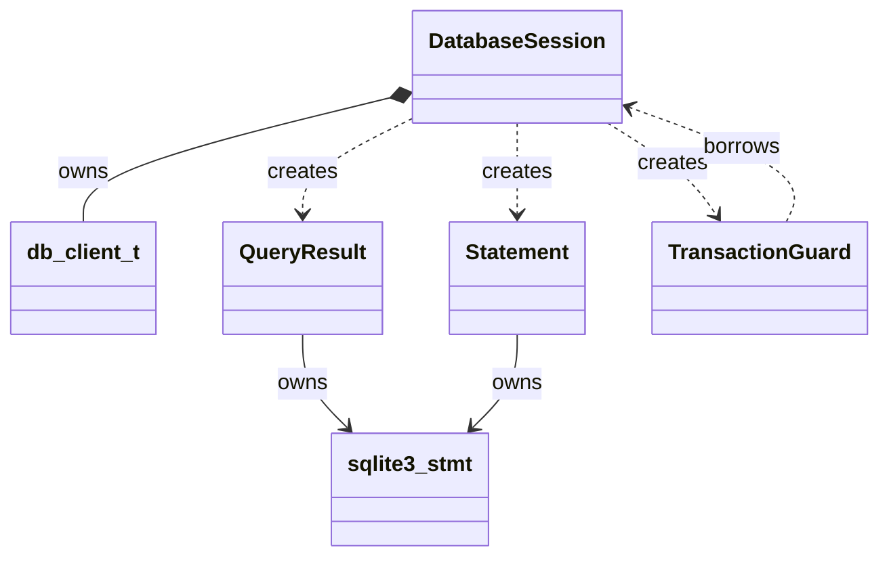

# SQLite RAII Design

## Purpose

This document describes the C++17 RAII database layer introduced for Unified
WiFi Mesh, the ownership contract it provides, and the remaining work needed to
use it consistently. The intent is to reduce manual SQLite cleanup and result
context handling without changing the SQLite schema or database behavior.

RAII means that a C++ object owns a resource and releases it in its destructor.
Database handles, prepared statements, result cursors, and transaction rollback
are therefore tied to lexical scope instead of requiring every return path to
remember a matching cleanup call.

## Design Overview



### `DatabaseSession`

`DatabaseSession` owns a `db_client_t`, initializes the SQLite connection in
its constructor, and relies on `db_client_t` destruction to close the
connection. It exposes `valid()`, `status()`, `execute()`, and the native
connection for statement preparation. The session is deliberately
non-copyable and non-movable in the current implementation so borrowed
statements and results cannot silently retain a pointer to a moved owner.

The session currently exposes `legacy_client()` to support the existing
transaction methods while the APIs are being migrated. That escape hatch is a
temporary compatibility bridge and should be removed when transaction methods
move fully into the session/guard interface.

### `QueryResult`

`QueryResult` is a move-only owner of one `sqlite3_stmt *`. Its destructor
finalizes a remaining statement. Exhausting rows through `next()` also
finalizes the statement immediately. Early returns and exceptions therefore
release the cursor automatically.

`next()` returns `true` when a row is available and `false` when iteration is
complete or fails. `status()` and `has_error()` distinguish these cases:

| Condition | `valid()` | `next()` | `status()` / `has_error()` |
| --- | --- | --- | --- |
| Statement has a current/next row | `true` | `true` | `SQLITE_ROW`, no error |
| Successful query has no rows / end reached | May be true before first `next()` | `false` | `SQLITE_DONE`, no error |
| Prepare or step failure | `false` for prepare failure; statement is finalized on step failure | `false` | SQLite error code, `has_error() == true` |
| DML statement completed | `false` | Not iterated | `SQLITE_DONE`, no error |

Columns are addressed using a 1-based index, matching the previous client API.
String access can populate `std::string` or a caller-provided fixed buffer with
its capacity. A SQL `NULL` string clears the `std::string` or the first byte of
the buffer and returns `false`/`nullptr`.

Example:

```cpp
QueryResult result = db.execute(
    "SELECT ControllerID FROM NetworkList WHERE ID = 'OneWifiMesh';");

if (!result.valid()) {
    return -1; // Prepare/connection failure; inspect result.status().
}

if (!result.next()) {
    if (result.has_error()) {
        return -1; // SQLite step error.
    }
    return 0; // Query succeeded; no matching row.
}

std::string controller_id;
if (!result.get_string(1, controller_id)) {
    return -1;
}
```

### `Statement`

`Statement` prepares a direct SQLite statement and finalizes it in its
destructor. It is move-only and exposes `valid()`, `status()`, `step()`, and a
native handle for binding/accessors. It borrows the SQLite connection from the
session. The session must outlive every `Statement` using its handle.

Example:

```cpp
Statement statement(db, "INSERT INTO NetworkList (ID) VALUES (?1);");
if (!statement.valid()) {
    return statement.status();
}

sqlite3_bind_text(statement.native_handle(), 1, "OneWifiMesh", -1,
                  SQLITE_STATIC);
int rc = statement.step();
```

The current wrapper does not yet provide typed bind helpers or serialize
statement operations through `db_client_t`'s mutex. Callers using `Statement`
must not concurrently operate on the same connection until connection-level
serialization is added or otherwise guaranteed.

### `TransactionGuard`

Construction begins `BEGIN IMMEDIATE TRANSACTION`. If begin succeeds, the
guard is active. `commit()` commits and deactivates the guard when successful.
If the guard leaves scope while still active, its destructor attempts rollback.
This protects early returns and exception unwinding without requiring a catch
block.

```cpp
TransactionGuard transaction(db);
if (!transaction.active()) {
    return transaction.status();
}

if (write_first_row(db) != 0 || write_second_row(db) != 0) {
    return -1; // Destructor rolls back.
}

return transaction.commit();
```

Transactions must not be nested on the same SQLite connection unless an
explicit savepoint policy is added. A failed commit leaves the guard active, so
its destructor makes a best-effort rollback. The destructor cannot report a
rollback failure; callers needing that diagnostic should explicitly roll back
through a future status-returning operation before scope exit.

## Error Handling

The layer uses SQLite integer result codes and the project's existing
return-code style; it does not throw exceptions. This avoids introducing a new
exception policy into the embedded controller and keeps failures explicit at
call sites. `QueryResult::status()` preserves the SQLite status, while
`DatabaseSession::status()` reports connection initialization status and
`Statement::status()` reports preparation status.

An invalid result is not synonymous with an empty result. An empty `SELECT`
has a valid statement and reaches `SQLITE_DONE` on `next()`. A prepare failure
has no statement and an SQLite error status. DML completes with `SQLITE_DONE`
but has no row cursor, so `valid()` is false.

Logging is intentionally not embedded throughout the RAII destructors.
Destructors cannot safely return errors; explicit operations return status and
callers decide how to log or recover. Cleanup itself remains best-effort.

## Current Migration Coverage

`db_client_t::execute()` now returns `QueryResult`; the raw `void *` result
context, `next_result()`, `free_result()`, and context-based string/number
accessors have been removed. The `db_easy_mesh_t` virtual contracts use
`QueryResult&`, and the `dm_*_list.cpp` sync/search loops consume
`QueryResult::next()` and its value accessors. Database tests use the RAII
result type and cover early cleanup, empty selects, and invalid SQL.

`is_table_empty()` treats a valid zero-row result as empty and logs SQLite
status on prepare/step errors. It returns `true` for either condition so the
existing initialization-recovery path remains unchanged, but the diagnostic
distinguishes an error from an empty table.

`DatabaseSession`, `Statement`, and `TransactionGuard` are available as a
higher-level API. Existing list code still receives `db_client_t&` for
database writes. Converting all writes to session methods is a follow-on
cleanup; it is not required to use RAII for query result ownership.

## Ownership Rules

- A `DatabaseSession` owns its `db_client_t` and SQLite connection.
- `QueryResult` owns its `sqlite3_stmt`; it does not own the connection.
- `Statement` owns its `sqlite3_stmt`; it does not own the connection.
- `TransactionGuard` borrows its `DatabaseSession` and must be destroyed first.
- Results and statements must not outlive their session/connection.
- Do not share an active `QueryResult` or `Statement` between threads.
- A single connection has one transaction state; avoid nested guards.

The required declaration order is naturally expressed by stack scope:

```cpp
DatabaseSession db(path);
TransactionGuard transaction(db);
QueryResult result = db.execute(query);
```

Destruction occurs in reverse order: result, transaction, then session.

## Risks and Trade-offs

### Thread safety

`db_client_t` serializes its own operations with a mutex. `QueryResult` and
`Statement` currently call SQLite directly and do not acquire that mutex.
Concurrent operations on one connection therefore need an explicit policy
before wider adoption. Recommended follow-up: provide a connection-level
operation lock shared by the session and all statements/results, or enforce
single-thread ownership of each session.

### Transaction nesting

SQLite transactions do not nest. A second `TransactionGuard` on the same
session will fail to begin. Supporting nesting requires savepoints and a
well-defined commit/rollback policy; it should not be added implicitly.

### Performance and memory

The wrappers are stack objects, use no third-party dependencies, and do not
allocate a heap context per result. `QueryResult` stores a few pointers/status
fields. `std::string` access may allocate; fixed-buffer access remains
available for embedded paths where allocation should be avoided.

### Compatibility

The SQL schema, query text, and row order are unchanged. The C++ `db_client`
result API is source-incompatible with code that used `void *`, so all in-tree
call sites and tests must migrate together. External consumers of `db_client_t`
must be identified before release. No compatibility shim should retain the
unsafe context-based contract indefinitely.

### Existing query construction

RAII fixes ownership and cleanup, not SQL construction. Existing variadic
formatting in `db_easy_mesh_t` still interpolates values into SQL. A separate
prepared-statement/binding migration is needed to address quoting, malformed
values, and injection risks.

## Recommended Follow-up Work

1. Add connection-level synchronization for `Statement` and `QueryResult`, or
   document and enforce one-thread-per-session use.
2. Add typed bind/accessor APIs to `Statement` and migrate variadic SQL
   builders to prepared statements.
3. Make table/schema/write helpers return meaningful error codes rather than
   returning success after ignored `execute()` failures.
4. Add test coverage for SQLite step errors, transaction begin/commit/rollback
   failures, move assignment, and bounded string truncation.
5. Remove the temporary `DatabaseSession::legacy_client()` exposure once
   transaction and write APIs are routed through the session abstraction.